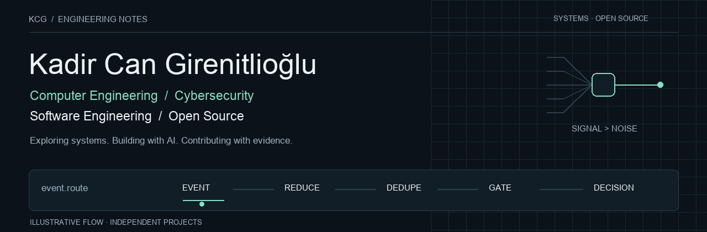

<picture>
  <source media="(prefers-reduced-motion: reduce) and (prefers-color-scheme: light)" srcset="assets/hero-light.png">
  <source media="(prefers-reduced-motion: reduce)" srcset="assets/hero-dark.png">
  <source media="(prefers-color-scheme: light)" srcset="assets/hero-light.gif">
  
</picture>

[GitHub](https://github.com/kadir2848) &nbsp; / &nbsp; [Hugging Face](https://huggingface.co/girenit) &nbsp; / &nbsp; [Interactive lab](https://kadir2848.github.io/codex-orchestrator-showcase/) &nbsp; / &nbsp; [Merged OSS work](https://github.com/OilpriceAPI/oilpriceapi-go/pull/44)

## About / current focus

I'm Kadir Can Girenitlioğlu. I build software, explore systems and use AI-assisted engineering to work through concrete problems. My current work includes a local Codex orchestration lab and a public simulation of its event-reduction and reasoning-gate concepts.

**Interests:** computer engineering, cybersecurity, networking and cloud infrastructure. **Engineering focus:** predictable behavior, explicit boundaries and regression tests.

## Selected work

<table>
<tr>
<td width="50%" valign="top">
<h3><a href="https://github.com/kadir2848/codex-orchestrator-showcase">Codex Orchestrator Lab ↗</a></h3>

Interactive event reduction, semantic deduplication and budget-aware gates. Deterministic, synthetic and entirely in the browser.

JavaScript · Python tooling · Systems design

</td>
<td width="50%" valign="top">
<h3><a href="https://huggingface.co/spaces/girenit/Argus">Argus showcase ↗</a></h3>

Public cybersecurity product overview and demo gateway on Hugging Face. Argus is owned by We'Rea; developed by Girenit and GoktugD.

Cybersecurity · Product documentation · Static web

</td>
</tr>
<tr>
<td valign="top">
<h3><a href="https://github.com/kadir2848/ustadan-landing">Ustadan ↗</a></h3>

Responsive Turkish landing page for a home-services app concept.

HTML · CSS · Vercel

</td>
<td valign="top">
<h3><a href="https://github.com/kadir2848/veya-support">Veya support ↗</a></h3>

Support and policy pages with Turkish / English language switching.

HTML · CSS · JavaScript · GitHub Pages

</td>
</tr>
</table>

## Open source

| Contribution | Engineering detail |
| :--- | :--- |
| **[OilpriceAPI Go SDK · #44](https://github.com/OilpriceAPI/oilpriceapi-go/pull/44)** — merged | Isolated timeout overrides from caller-owned HTTP clients, made option ordering consistent, and added shared-state and concurrent-construction regression tests. |

## Tools / technologies

**Programming** &nbsp; Go · Python · JavaScript · HTML/CSS 
**Engineering** &nbsp; HTTP clients · regression testing · structured event reduction 
**Workflow** &nbsp; Git · GitHub · Codex CLI · GitHub Pages · Vercel

## Hugging Face / AI work

[**girenit on Hugging Face ↗**](https://huggingface.co/girenit) hosts the [Argus overview](https://huggingface.co/spaces/girenit/Argus). My [orchestration showcase](https://github.com/kadir2848/codex-orchestrator-showcase) explores deterministic work before model calls; its public demo runs without inference. These are engineering showcases, not trained models.

Connect through <a href="https://github.com/kadir2848">GitHub</a> or <a href="https://huggingface.co/girenit">Hugging Face</a>. Codex Orchestrator Lab is an independent project, not affiliated with or endorsed by OpenAI.
